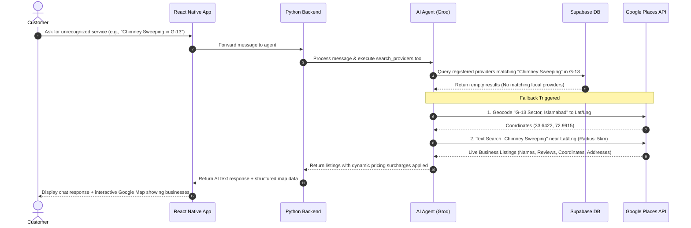

# Google Maps & Places Fallback Integration Guide

This guide outlines the precise steps, API credentials, backend modifications, and frontend components required to replace our current simulated Google Maps seeds with a live, real-time Google Places and Geocoding API integration.

---

## 1. Prerequisites & API Credentials

To query live local businesses and plot them on interactive maps, you will need a **Google Cloud Platform (GCP)** console account with billing enabled.

> [!IMPORTANT]
> Google requires a billing account to activate the Places API, but they provide a free **$200 monthly credit** which is more than sufficient for development and low-volume production.

### Enabled APIs in Google Console
You must enable the following APIs in your GCP Console:
1. **Places API (New)**: For searching local businesses near a location (using text queries like `"Plumbing services"` or `"AC repair"`).
2. **Geocoding API**: For converting user sector names (e.g. `"G-13, Islamabad"`) or GPS coordinates into lat/lng pairs.
3. **Maps SDK for Android / iOS**: If you plan to render native maps inside the mobile application.

---

## 2. Technical Architecture & Data Flow

When a user requests a service through the AI Agent, the system follows this check-and-fallback pattern:



---

## 3. Backend Implementation (Python)

### A. Environment Configuration
Add your API key to your backend `.env` file:
```env
GOOGLE_MAPS_API_KEY=your_google_maps_api_key_here
```

### B. Fallback Tool Implementation
Below is the python integration to be inserted into `hidmetgo-backend/app/hidmetgo_agent/agent.py`. Replace the mock `gmaps_seeds` block with live Google API queries:

```python
import os
import requests

GOOGLE_API_KEY = os.getenv("GOOGLE_MAPS_API_KEY")

def get_coordinates_from_sector(sector: str) -> tuple:
    """Converts a sector name (e.g., 'G-13, Islamabad') into lat/lng using Google Geocoding API."""
    if not GOOGLE_API_KEY:
        return 33.6422, 72.9915  # Fallback G-13 central coordinates
    
    address = f"{sector}, Islamabad, Pakistan"
    url = f"https://maps.googleapis.com/maps/api/geocode/json?address={address}&key={GOOGLE_API_KEY}"
    
    try:
        res = requests.get(url)
        if res.ok:
            results = res.json().get("results")
            if results:
                location = results[0]["geometry"]["location"]
                return location["lat"], location["lng"]
    except Exception as e:
        print(f"Geocoding error: {e}")
    
    return 33.6422, 72.9915  # G-13 fallback

def search_google_places(query: str, lat: float, lng: float, radius_meters: int = 5000) -> list:
    """Searches live local businesses using Google Places API (New Text Search)."""
    if not GOOGLE_API_KEY:
        return []
        
    url = "https://places.googleapis.com/v1/places:searchText"
    headers = {
        "Content-Type": "application/json",
        "X-Goog-Api-Key": GOOGLE_API_KEY,
        # Field mask limits returned fields to optimize latency and costs
        "X-Goog-FieldMask": "places.displayName,places.formattedAddress,places.location,places.rating,places.userRatingCount,places.nationalPhoneNumber"
    }
    
    payload = {
        "textQuery": query,
        "locationBias": {
            "circle": {
                "center": {"latitude": lat, "longitude": lng},
                "radius": float(radius_meters)
            }
        }
    }
    
    try:
        res = requests.post(url, headers=headers, json=payload)
        if res.ok:
            places = res.json().get("places", [])
            return places
    except Exception as e:
        print(f"Google Places query error: {e}")
        
    return []
```

---

## 4. Frontend Integration (Expo / React Native)

To present this dynamically on the consumer's end, we should display a native interactive map.

### A. Install Native Map Package
In the project root, run:
```bash
npx expo install react-native-maps expo-location
```

### B. Interactive Fallback Map Component
Add a gorgeous floating `MapView` overlay in `components/haazir/consumer/HzHomeScreen.tsx` or search results when `google_maps_providers` are returned by the backend:

```tsx
import React from 'react';
import { StyleSheet, View, Text } from 'react-native';
import MapView, { Marker, PROVIDER_GOOGLE } from 'react-native-maps';
import { Colors } from '../../constants/theme';

interface MapProps {
  userLocation: { latitude: number; longitude: number };
  places: Array<{
    name: string;
    address: string;
    latitude: number;
    longitude: number;
    rating: number;
  }>;
}

export const FallbackMapView: React.FC<MapProps> = ({ userLocation, places }) => {
  return (
    <View style={styles.container}>
      <MapView
        provider={PROVIDER_GOOGLE}
        style={styles.map}
        initialRegion={{
          latitude: userLocation.latitude,
          longitude: userLocation.longitude,
          latitudeDelta: 0.05,
          longitudeDelta: 0.05,
        }}
      >
        {/* User Current Location Marker */}
        <Marker
          coordinate={userLocation}
          title="Your Location"
          pinColor={Colors.accent}
        />

        {/* Local Businesses Resolved from Google Maps */}
        {places.map((place, idx) => (
          <Marker
            key={idx}
            coordinate={{ latitude: place.latitude, longitude: place.longitude }}
            title={place.name}
            description={`⭐ ${place.rating} - ${place.address}`}
            pinColor="#ef4444"
          />
        ))}
      </MapView>
    </View>
  );
};

const styles = StyleSheet.create({
  container: {
    height: 220,
    width: '100%',
    borderRadius: 14,
    overflow: 'hidden',
    marginVertical: 12,
    borderWidth: 1,
    borderColor: Colors.border,
  },
  map: {
    ...StyleSheet.absoluteFillObject,
  },
});
```

---

## 5. Summary Checklist to Implement

1. [ ] **GCP Console Setup**: Open Google Cloud Console, create a project, link a billing account, and generate a secure API Key restricted to your API bundle.
2. [ ] **Backend Environment Variables**: Paste `GOOGLE_MAPS_API_KEY` into your backend `.env` file.
3. [ ] **Replace Fallback Logic in `agent.py`**: Update `search_providers` using the geocoding and places helper functions.
4. [ ] **Install Frontend Packages**: Install `react-native-maps` and `expo-location`.
5. [ ] **UI Rendering Update**: Modify the chat window to parse the backend `google_maps_providers` array and render them on an interactive `FallbackMapView` component.
