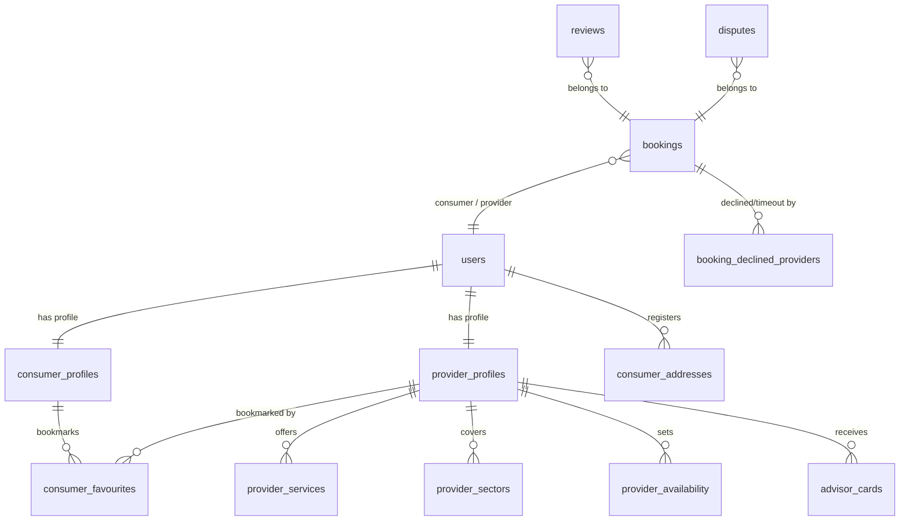

# Haazir (OddJobs) — V2 Project Digest & Implementation Blueprint

This document provides a highly detailed synthesis of the **Haazir (OddJobs) Project Plan V2** (Files 01–08) and maps it against the current codebase status. It serves as our source of truth and architectural blueprint for the rest of the development lifecycle.

---

## 1. Project Vision & Core Principles

**Haazir** is an AI-first, mobile-first marketplace for Islamabad’s informal service economy (plumbers, AC technicians, cleaners, etc.). It replaces fragmented, low-trust discovery channels (WhatsApp, phone calls) with two specialized, conversational AI agents that coordinate the entire service lifecycle.

### Core Agentic Lifecycle
Every interaction with the platform follows an agent-driven cycle:
$$\text{Observe} \longrightarrow \text{Reason} \longrightarrow \text{Decide} \longrightarrow \text{Act} \longrightarrow \text{Evaluate} \longrightarrow \text{Adapt}$$

### Architectural Ground Rules
1. **Agent-first Operations**: Workflows are dynamically reasoned by the agents rather than dictated by hardcoded rule engines.
2. **Two Specialized Agents**: 
   * **Consumer Agent**: Governs service request interpretation, complexity scoring, multi-factor provider matching, dynamic pricing, and sequential booking.
   * **Provider Agent**: Governs provider onboarding, profile modifications, daily dashboard AI advisor feeds, and provider-side dispute filings.
3. **Reasoning Transparency ("Show Haazir's Thinking")**: A prominent toggle on all agent screens exposes the raw reasoning steps (language detection, confidence scores, ranking matrix, dynamic pricing breakdowns).
4. **Sequential Booking (No Broadcasts)**: Only the single consumer-selected provider is notified. The provider has a 15-minute countdown to accept or decline before the request auto-expires and the agent retries.

---

## 2. Technical Stack Alignment

| Layer | Specifications | Current Status |
|---|---|---|
| **Mobile Frontend** | Expo 54.0.33 (React Native) + Expo Router 6.0.23 + TypeScript | Basic login, home, modes, and simple customer/provider chat screens implemented. |
| **Backend API** | Python Flask API (`http://localhost:5000`) | Flask server in place; API routing configured. |
| **AI Layer** | Llama-3.3-70b-versatile via Groq API (fallback to Gemini via Vertex AI planned) | Implemented using Groq SDK with stateless history tracking. |
| **Database & Auth** | Supabase (PostgreSQL + Auth + Storage) | `schema.sql` present. Need to migrate to live Supabase database and wire queries. |
| **Push Notifications** | FCM via Expo Notifications + Supabase Edge Functions | Planned/Partially stubbed. |
| **Location & Maps** | Google Maps SDK + Haversine SQL queries | Manual pin drop lat/lng planned. Distance currently mocked. |

---

## 3. Database Schema Overview (`schema.sql`)

The database is built on Supabase PostgreSQL. Below are the key entity groups:



### Key Custom Types
* `user_role`: `'consumer'`, `'provider'`
* `preferred_time`: `'morning'`, `'afternoon'`, `'evening'`
* `loyalty_tier`: `'none'`, `'bronze'`, `'silver'`, `'gold'`
* `availability_status`: `'available'`, `'unavailable'`, `'search_hidden'`, `'suspended'`, `'blacklisted'`
* `account_status`: `'active'`, `'suspended'`, `'search_hidden'`, `'blacklisted'`
* `complexity_tier`: `'basic'`, `'intermediate'`, `'complex'`
* `urgency_level`: `'same_day'`, `'next_day'`, `'scheduled'`

---

## 4. Phase-by-Phase Algorithmic Mechanics

### 4.1 Job Complexity Classifier
Input text is parsed, mapping the requested task to a default category tier:
* **Basic**: Routine cleaning, minor fixes, sofa cleaning (`CS-01` to `CS-07`).
* **Intermediate**: Standard repairs, geyser installations, AC dismounts (`HS-01` to `HS-14`).
* **Complex**: Multi-appliance failures, water tank installations, compressor or PCB issues (`HS-15`).

**Keyword Upward Adjustments (+1 Tier, Capped at Complex):**
* *"bilkul kaam nahi kar raha" / "completely stopped"* $\rightarrow$ +1 Tier.
* *"bar bar problem" / "recurring issue"* $\rightarrow$ +1 Tier.
* *"aag / spark / leakage / burning smell"* $\rightarrow$ +1 Tier + Safety warning.

---

### 4.2 Multi-Factor Provider Matching & Ranking
Two discovery pipelines run in parallel when a job is initiated:

#### Pipeline A: Registered Haazir Providers
1. **Hard Filters (Sequential Elimination)**:
   * Service Match (Offers the exact `service_code`)
   * Sector Coverage (Consumer's sector in provider's covered list)
   * Real-time Availability (Active schedule match, not Unavailable/Suspended, no double-booking overlaps + 30m travel buffer)
   * Session Exclusion (Provider has not already declined/timed out this job)
2. **Soft Scoring (Composite Score: 0–100)**:
   $$\begin{aligned}
   \text{Score} = & (\text{Rating} \times 0.20) + (\text{OnTimeScore} \times 0.18) + (\text{ReviewRecency} \times 0.12) \\
   & + (\text{SpecialisationMatch} \times 0.15) + (\text{ProximityScore} \times 0.15) \\
   & + (\text{CancellationScore} \times 0.10) + (\text{DisputeScore} \times 0.10)
   \end{aligned}$$
3. **Tiebreakers**: Higher total completed jobs. If `budget_sensitive = true`, lower base rate wins.

#### Pipeline B: Google Maps Providers (Seeded Mock Data)
* **Hard Filters**: Semantic category confidence $\ge 0.5$, Open status, valid Phone Number.
* **Soft Scoring**: Google Rating (25%), Review Count (20%), Sentiment Score (20%), Proximity (20%), Phone presence (10%), Semantic match (5%).

---

### 4.3 Dynamic Pricing Engine
Converts the provider’s registered base rate into a tailored estimate:

$$\text{Pre-Discount Estimate} = \text{Base Rate} + \text{Travel} + \text{Urgency} + \text{Complexity} + \text{Surge}$$

$$\text{Final Estimate} = \text{Pre-Discount Estimate} - \text{Loyalty Discount}$$

#### Surcharges & Adjustments:
1. **Travel Adjustment**: First 3 km free; $\text{PKR } 20\text{ per additional km}$ thereafter:
   $$\text{Travel Surcharge} = \max(0, \text{Distance} - 3) \times 20$$
2. **Urgency Adjustment**: Same-day $\rightarrow$ $+15\%$ of base rate; Next-day/Scheduled $\rightarrow$ $+0\%$.
3. **Complexity Adjustment**: Basic $\rightarrow$ $+0\%$; Intermediate $\rightarrow$ $+10\%$ of base rate; Complex $\rightarrow$ $+20\%$ of base rate.
4. **Surge Adjustment**: If $\ge 3 \text{ active requests}$ in same sector and service code in last 2 hours $\rightarrow$ $+10\%$ of base rate.
5. **Loyalty Discount (Haazir-Subsidized)**:
   * **Bronze** (3-7 bookings) $\rightarrow$ $5\%$ off.
   * **Silver** (8-14 bookings) $\rightarrow$ $10\%$ off.
   * **Gold** (15+ bookings) $\rightarrow$ $15\%$ off.
   * *Note: Providers always receive their full pre-discount rate; Haazir logs the difference as a platform subsidy.*

---

## 5. UI/UX & Navigation Structure (29 Screens)

The UI utilizes a modern, minimal, warm aesthetic featuring `#FAF8F5` backgrounds, `#FFFFFF` cards, `#F5A623` amber highlights (for CTAs, active steps, agent thinking panel borders), and `#4CAF84` green indicators (Verified status, active toggles).

### Screen Inventory Map

```
Shared Screens (4)
 ├── S-01 Splash Screen
 ├── S-02 Registration
 ├── S-03 Login
 └── S-04 Role Selection (Consumer vs Provider)

Consumer App (15 Screens)
 ├── C-01 Profile Setup Form
 ├── C-02 Home — AI Chat Surface (Thinking Panel Toggle, Active Booking Banner)
 ├── C-03 Provider Discovery Results (Two Tabs: Registered vs Google Maps)
 ├── C-04 Provider Profile (Details, ratings breakdown, past disputes count)
 ├── C-05 Booking Confirmation (Job details, itemized dynamic price breakdown)
 ├── C-06 Awaiting Provider Acceptance (15-min countdown timer)
 ├── C-07 Booking Confirmed Success
 ├── C-08 Active Job Detail (Status dots: Confirmed -> En Route -> Arrived -> In Progress -> Completed)
 ├── C-09 Feedback & Ratings Modal (4-dimension 1-10 scoring)
 ├── C-10 Re-initiate Search (Post-decline/timeout inline chat card)
 ├── C-11 Past Bookings History
 ├── C-12 Favourites Screen
 ├── C-13 Profile & Settings (Loyalty Tier badge, address book)
 ├── C-14 Dispute Chat Interface (Consumer Agent complaint intake)
 └── C-15 Dispute Case Status

Provider App (10 Screens)
 ├── P-01 Onboarding Chat (Provider Agent conversational setup - 10 steps)
 ├── P-02 Dashboard (Manual Availability Toggle, earnings, AI Advisor feed, upcoming list)
 ├── P-03 Notification Inbox (Job request cards with 15-min countdown timers)
 ├── P-04 Expanded Job Request Detail
 ├── P-05 Job Detail & Actions (Mark En Route -> Arrived -> Completed status steps)
 ├── P-06 Rate Consumer Modal (4-dimension 1-10 scoring)
 ├── P-07 Past Jobs History
 ├── P-08 Profile & Settings
 ├── P-09 Provider Dispute Chat
 └── P-10 Provider Dispute Status
```

---

## 6. Gap Analysis & Tactical Roadmap

Here is the concrete set of steps required to align the current **OddJobs** codebase with the **Haazir V2 Specification**:

### Phase 1: Database Migration & Repository Sync
* [ ] Initialize PostgreSQL schema inside our Supabase dashboard using the complete `schema.sql` file.
* [ ] Seed mock datasets for `gmaps_providers_mock`, initial registered `provider_profiles`, and sample `surge_flags`.
* [ ] Verify local repository status and pull the latest changes cleanly.

### Phase 2: Refactoring Backend Agents (`agent.py`)
* [ ] **Tool Integration**: Rewrite `search_providers` to query real Supabase provider and sector records, replacing the current mock logic.
* [ ] **Pricing Realignment**: Implement the exact dynamic pricing math (travel surcharges, same-day urgency, complexity tiers, surge logic, and subsidized loyalty tiers) inside the agent tool.
* [ ] **Complexity Upgrading**: Implement keyword parsing within `agent.py` to auto-adjust complexity based on safety and severity keywords.
* [ ] **Provider Onboarding**: Wire the `register_provider` tool to write user, profile, sectors, and schedule details directly to PostgreSQL.

### Phase 3: Mobile Frontend Enhancement
* [ ] **State & Flow Integration**: Connect the React Native app's screen transitions to map the full 29-screen journey (Routing from Chat to Provider Results, Profile, Confirmation, and Countdown screens).
* [ ] **Thinking Visibility**: Implement the "Show Haazir's Thinking" toggle on the customer chat screen, dynamically rendering raw backend agent logs inside a dedicated amber-bordered container.
* [ ] **Status Flow Tracking**: Develop the en-route, arrived, and complete workflow state steps for both consumer and provider dashboards.

### Phase 4: Push Notifications & CRON Jobs
* [ ] Set up Supabase Edge Functions to orchestrate FCM notifications (PN-01 request alerts, CN-01 confirmations, reminders, and non-response penalties).
* [ ] Configure scheduled database webhooks to automatically expire bookings after the 15-minute countdown and adjust DisputeScores.
